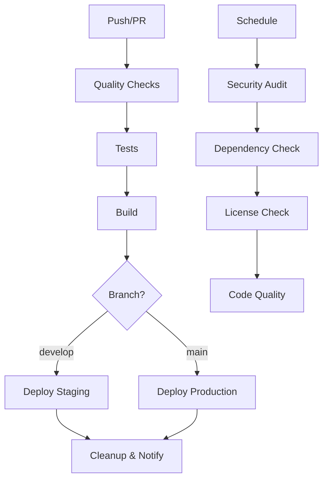

# 🚀 CI/CD Pipeline - ExemploApp

## 📋 Visão Geral

O projeto ExemploApp utiliza GitHub Actions para automatizar todo o processo de integração contínua e deploy contínuo. O pipeline garante qualidade, segurança e deploy automático para diferentes ambientes.

## 🔄 Workflows Implementados

### 1. **CI/CD Principal** (`.github/workflows/ci-cd.yml`)
**Trigger:** Push para `main` ou `develop`, Pull Requests

**Jobs:**
- 🔍 **Quality Checks**: Verificações de código, TypeScript, ESLint, Prisma
- 🧪 **Tests**: Testes unitários e de integração
- 🏗️ **Build**: Compilação da aplicação
- 🚀 **Deploy Staging**: Deploy automático para staging (branch `develop`)
- 🚀 **Deploy Production**: Deploy automático para produção (branch `main`)
- 🧹 **Cleanup**: Limpeza e notificações

### 2. **Segurança** (`.github/workflows/security.yml`)
**Trigger:** Agendado (segundas-feiras), Push, Pull Requests

**Jobs:**
- 🔒 **Security Audit**: Verificação de vulnerabilidades nas dependências
- 📦 **Dependency Check**: Verificação de pacotes desatualizados
- 📄 **License Check**: Verificação de licenças compatíveis
- 🎯 **Code Quality**: Análise de código com CodeQL

### 3. **Deploy Manual** (`.github/workflows/manual-deploy.yml`)
**Trigger:** Execução manual via GitHub UI

**Funcionalidades:**
- 🎛️ **Escolha de Ambiente**: Staging ou Produção
- 🏷️ **Versionamento**: Deploy de versões específicas
- 🔔 **Notificações**: Relatórios de deploy

### 4. **Testes Automatizados** (`.github/workflows/tests.yml`)
**Trigger:** Push, Pull Requests, Agendado (diário)

**Jobs:**
- 🧪 **Unit Tests**: Testes unitários
- 🔗 **Integration Tests**: Testes de integração com banco
- 🎭 **E2E Tests**: Testes end-to-end
- ⚡ **Performance Tests**: Testes de performance
- 📊 **Test Summary**: Relatório consolidado

## 🏗️ Arquitetura do Pipeline



## 🔧 Configuração Necessária

### 1. **Secrets do GitHub**

Configure os seguintes secrets no repositório:

```bash
# Database
DATABASE_URL=postgresql://...

# NextAuth
NEXTAUTH_SECRET=...
NEXTAUTH_URL=https://exemplo-app.vercel.app

# Google OAuth
GOOGLE_CLIENT_ID=...
GOOGLE_CLIENT_SECRET=...

# Vercel
VERCEL_TOKEN=...
VERCEL_ORG_ID=...
VERCEL_PROJECT_ID=...

# Cloudinary (opcional)
CLOUDINARY_CLOUD_NAME=...
CLOUDINARY_API_KEY=...
CLOUDINARY_API_SECRET=...

# Stripe (opcional)
STRIPE_SECRET_KEY=...
STRIPE_PUBLISHABLE_KEY=...
```

### 2. **Environments no GitHub**

Crie os seguintes environments:
- **staging**: Para deploys de desenvolvimento
- **production**: Para deploys de produção

### 3. **Proteções de Branch**

Configure proteções para as branches principais:
- `main`: Requer PR, reviews obrigatórios, status checks
- `develop`: Requer status checks

## 🚀 Como Usar

### Deploy Automático

```bash
# Deploy para Staging
git push origin develop

# Deploy para Produção
git push origin main
```

### Deploy Manual

1. Acesse **Actions** no GitHub
2. Selecione **Manual Deploy**
3. Clique em **Run workflow**
4. Escolha o ambiente e versão
5. Execute o workflow

### Verificação Pré-Deploy Local

```bash
# Verificação completa
npm run check:deploy

# Build seguro
npm run build:safe
```

## 📊 Monitoramento

### Status dos Workflows

- **✅ Verde**: Todos os checks passaram
- **❌ Vermelho**: Algum check falhou
- **🟡 Amarelo**: Workflow em execução
- **⚪ Cinza**: Workflow cancelado/pendente

### Artifacts Gerados

- **build-files**: Arquivos de build
- **security-audit-results**: Relatório de segurança
- **test-results**: Resultados de testes
- **license-report**: Relatório de licenças

## 🔍 Troubleshooting

### Problemas Comuns

#### 1. **Build Falha**
```bash
# Verificar logs do workflow
# Verificar variáveis de ambiente
# Executar localmente: npm run build:safe
```

#### 2. **Deploy Falha**
```bash
# Verificar secrets do Vercel
# Verificar permissões do token
# Verificar configuração do projeto
```

#### 3. **Testes Falham**
```bash
# Verificar configuração do banco de teste
# Verificar dependências
# Executar testes localmente
```

### Logs e Debugging

1. Acesse **Actions** no GitHub
2. Clique no workflow falhado
3. Expanda os jobs para ver logs detalhados
4. Use os artifacts para análise offline

## 🔄 Fluxo de Desenvolvimento

### 1. **Desenvolvimento**
```bash
# Criar feature branch
git checkout -b feature/nova-funcionalidade

# Desenvolver e commitar
git add .
git commit -m "feat: nova funcionalidade"

# Push para triggerar CI
git push origin feature/nova-funcionalidade
```

### 2. **Pull Request**
- Criar PR para `develop`
- CI executa automaticamente
- Revisar resultados
- Merge após aprovação

### 3. **Deploy Staging**
- Merge para `develop`
- Deploy automático para staging
- Testes de aceitação

### 4. **Deploy Produção**
- Merge para `main`
- Deploy automático para produção
- Monitoramento pós-deploy

## 📈 Métricas e Relatórios

### Dashboard do GitHub
- **Insights** → **Actions**: Visão geral dos workflows
- **Security** → **Code scanning**: Vulnerabilidades encontradas
- **Dependencies**: Dependências com vulnerabilidades

### Relatórios Automáticos
- **Segurança**: Relatório semanal de vulnerabilidades
- **Dependências**: Relatório de pacotes desatualizados
- **Qualidade**: Relatório de qualidade de código

## 🛠️ Manutenção

### Atualizações Regulares

1. **Dependências**: Atualizar pacotes regularmente
2. **Workflows**: Manter actions atualizadas
3. **Secrets**: Rotacionar tokens periodicamente
4. **Environments**: Revisar configurações

### Monitoramento Contínuo

- Verificar falhas de workflow diariamente
- Revisar relatórios de segurança semanalmente
- Atualizar dependências mensalmente
- Revisar configurações trimestralmente

## 🔐 Segurança

### Boas Práticas Implementadas

- ✅ Secrets não expostos em logs
- ✅ Branches protegidas
- ✅ Reviews obrigatórios
- ✅ Verificação de vulnerabilidades
- ✅ Análise de código com CodeQL
- ✅ Verificação de licenças

### Próximos Passos

- [ ] Implementar testes automatizados
- [ ] Adicionar monitoramento de performance
- [ ] Configurar alertas de falha
- [ ] Implementar rollback automático
- [ ] Adicionar testes de carga

---

**📞 Suporte**: Para dúvidas sobre CI/CD, consulte a documentação do GitHub Actions ou entre em contato com a equipe de desenvolvimento.
