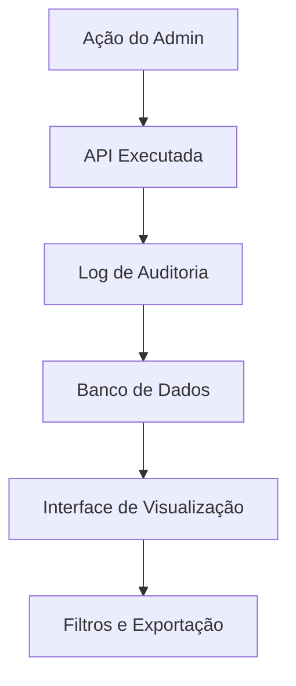

# 📊 Sistema de Logs de Auditoria - ExemploApp

## 🎯 Visão Geral

O sistema de logs de auditoria foi implementado para rastrear todas as ações realizadas pelos administradores no painel admin. Isso garante transparência, segurança e compliance com regulamentações.

## 🔧 Funcionalidades Implementadas

### ✅ **Logs Automáticos**
- Login/Logout de administradores
- Criação, edição e visualização de usuários
- Exportação de dados
- Ações em assinaturas
- Tentativas de login falhadas

### ✅ **Interface de Visualização**
- Lista paginada de logs
- Filtros por ação, recurso, data
- Estatísticas dos últimos 7 dias
- Exportação em CSV
- Detalhes expandíveis

### ✅ **Logout no Painel Admin**
- Menu dropdown no header
- Opção "Segurança" para gerenciar 2FA
- Logout com registro de auditoria
- Redirecionamento seguro

---

## 🏗️ Arquitetura do Sistema

### **📊 Estrutura do Banco de Dados**

```sql
-- Logs de auditoria
CREATE TABLE audit_logs (
  id UUID PRIMARY KEY,
  admin_id UUID NOT NULL,
  admin_email VARCHAR(255) NOT NULL,
  action VARCHAR(100) NOT NULL,
  resource VARCHAR(100) NOT NULL,
  resource_id VARCHAR(255),
  details TEXT,
  ip_address INET,
  user_agent TEXT,
  timestamp TIMESTAMP DEFAULT NOW()
);
```

### **🔄 Fluxo de Auditoria**



---

## 📁 Arquivos Implementados

### **🔧 Utilitários**
- `src/lib/auditLogger.ts` - Sistema principal de auditoria
- `src/lib/twoFactorAuth.ts` - Sistema 2FA (já implementado)

### **🌐 APIs**
- `src/app/api/admin/audit-logs/route.ts` - Listar logs
- `src/app/api/admin/audit-logs/export/route.ts` - Exportar logs
- `src/app/api/admin/audit-logs/logout/route.ts` - Registrar logout
- `src/app/api/admin/audit-logs/login-success/route.ts` - Login bem-sucedido
- `src/app/api/admin/audit-logs/login-failed/route.ts` - Login falhado

### **🎨 Interfaces**
- `src/app/admin/audit-logs/page.tsx` - Página de logs
- `src/app/admin/security/page.tsx` - Página de segurança (2FA)
- `src/components/admin/AdminClientLayout.tsx` - Layout com logout

---

## 🚀 Como Usar

### **👤 Para Administradores**

#### **Visualizar Logs**
1. Acesse `/admin/audit-logs`
2. Use filtros para encontrar logs específicos
3. Clique em "Ver detalhes" para expandir informações
4. Exporte logs em CSV se necessário

#### **Gerenciar Segurança**
1. Clique no seu nome no header
2. Selecione "Segurança"
3. Gerencie dispositivos confiáveis
4. Revogue confiança se necessário

#### **Fazer Logout**
1. Clique no seu nome no header
2. Selecione "Sair"
3. Será redirecionado para login

### **🔧 Para Desenvolvedores**

#### **Adicionar Logs a Novas APIs**
```typescript
import { logUserAction, AuditActions } from '@/lib/auditLogger'

// Em uma API de criação de usuário
await logUserAction(
  adminId,
  adminEmail,
  AuditActions.USER_CREATE,
  newUserId,
  { userName, userEmail },
  req
)
```

#### **Logs Pré-definidos**
```typescript
// Ações disponíveis
AuditActions.LOGIN
AuditActions.LOGOUT
AuditActions.USER_CREATE
AuditActions.USER_UPDATE
AuditActions.DATA_EXPORT
// ... e mais
```

---

## 🔒 Segurança

### **🛡️ Dados Registrados**

#### **Informações do Admin**
- ID e email do administrador
- Timestamp da ação
- IP address
- User agent

#### **Detalhes da Ação**
- Tipo de ação (CREATE, UPDATE, DELETE, etc.)
- Recurso afetado (user, subscription, etc.)
- ID do recurso
- Dados antes/depois (quando aplicável)

#### **Contexto de Segurança**
- Tentativas de login falhadas
- Logouts registrados
- Exportações de dados
- Alterações em configurações

### **🚨 Alertas de Segurança**

#### **Eventos Monitorados**
- Múltiplas tentativas de login falhadas
- Ações suspeitas (muitas alterações)
- Exportações de dados
- Alterações em configurações críticas

#### **Próximos Passos**
- Alertas via WhatsApp
- Dashboard de segurança
- Relatórios automáticos

---

## 📈 Métricas e Relatórios

### **Dashboard de Logs**
- Estatísticas dos últimos 7 dias
- Ações mais comuns
- Administradores mais ativos
- Recursos mais acessados

### **Exportação**
- Formato CSV
- Filtros aplicados
- Dados completos
- Timestamp de exportação

### **Filtros Disponíveis**
- Por administrador
- Por ação
- Por recurso
- Por período
- Por IP address

---

## 🧪 Testes

### **Testes Manuais**

#### **Logs de Login**
```bash
# 1. Faça login no admin
# 2. Acesse /admin/audit-logs
# 3. Verifique se o login foi registrado
# 4. Teste logout e verifique novamente
```

#### **Logs de Ações**
```bash
# 1. Crie um usuário no painel
# 2. Edite um usuário existente
# 3. Exporte dados
# 4. Verifique se todas as ações foram registradas
```

#### **Filtros e Exportação**
```bash
# 1. Use filtros na página de logs
# 2. Teste exportação CSV
# 3. Verifique se os dados estão corretos
```

---

## 🔧 Manutenção

### **Limpeza de Logs**
- Logs são mantidos indefinidamente
- Considerar política de retenção
- Backup regular recomendado

### **Performance**
- Índices criados para consultas rápidas
- Paginação implementada
- Filtros otimizados

### **Monitoramento**
- Verificar logs regularmente
- Alertas para ações suspeitas
- Relatórios de atividade

---

## 🚀 Próximos Passos

### **Melhorias Planejadas**
1. **Alertas WhatsApp** - Notificações de segurança
2. **Dashboard de Segurança** - Métricas em tempo real
3. **Relatórios Automáticos** - Envio periódico
4. **Retenção de Logs** - Política de limpeza
5. **Análise de Padrões** - Detecção de anomalias

### **Integrações Futuras**
- Sistema de alertas
- Dashboard de métricas
- Relatórios de compliance
- Análise de comportamento

---

## 📞 Suporte

### **Problemas Comuns**

#### **Logs não aparecem**
- Verificar se a tabela foi criada
- Confirmar se as APIs estão registrando
- Verificar logs do servidor

#### **Performance lenta**
- Verificar índices do banco
- Usar filtros para reduzir dados
- Considerar paginação

#### **Exportação falha**
- Verificar permissões de arquivo
- Confirmar formato CSV
- Verificar tamanho dos dados

### **Comandos Úteis**
```bash
# Verificar logs no banco
npx prisma studio

# Verificar estrutura
npx prisma db pull

# Resetar logs (CUIDADO!)
npx prisma migrate reset
```

---

**Última atualização**: Janeiro 2025  
**Versão**: 1.0.0  
**Status**: Implementado e funcional
