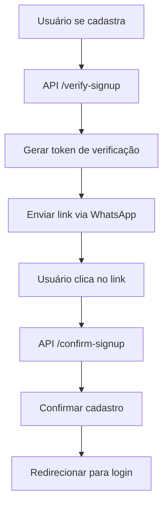
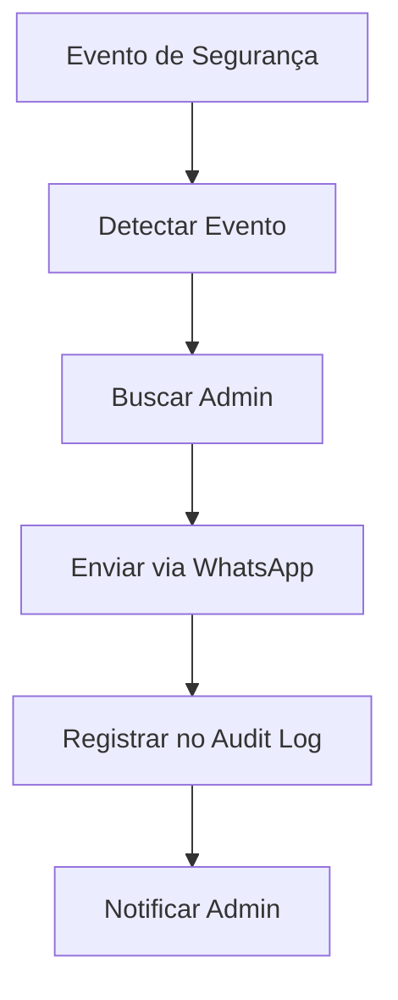

# 📱 Sistema WhatsApp - ExemploApp

## 🎯 Visão Geral

O sistema WhatsApp foi implementado para comunicação segura com usuários e administradores, incluindo verificação de cadastro, códigos 2FA e alertas de segurança.

## 🔧 Funcionalidades Implementadas

### ✅ **Verificação de Cadastro**
- Link de confirmação enviado via WhatsApp
- Mensagem explicativa sobre adicionar contato
- Token de verificação com expiração
- Página de confirmação responsiva

### ✅ **Códigos 2FA**
- Códigos de 6 dígitos via WhatsApp
- Integração com sistema 2FA existente
- Suporte a modo de teste e desenvolvimento

### ✅ **Alertas de Segurança**
- Notificações automáticas de eventos suspeitos
- Alertas manuais para administradores
- Histórico de alertas enviados
- Interface de gerenciamento

### ✅ **Integração Z-API**
- Reutilização da API WhatsApp existente
- Suporte a mensagens de texto e links
- Fallback para modo de desenvolvimento

---

## 🏗️ Arquitetura do Sistema

### **📊 Estrutura de Arquivos**

```
src/
├── lib/
│   └── whatsappService.ts          # Serviço principal WhatsApp
├── app/
│   ├── api/
│   │   ├── verify-signup/          # Verificação de cadastro
│   │   ├── confirm-signup/         # Confirmação de cadastro
│   │   └── admin/
│   │       └── security-alerts/    # Alertas de segurança
│   └── confirm-signup/             # Página de confirmação
└── components/
    └── admin/
        └── security-alerts/        # Interface de alertas
```

### **🔄 Fluxo de Verificação de Cadastro**



### **🚨 Fluxo de Alertas de Segurança**



---

## 📁 Arquivos Implementados

### **🔧 Serviços**
- `src/lib/whatsappService.ts` - Serviço principal WhatsApp
  - Formatação de números E164
  - Envio de mensagens de texto
  - Envio de mensagens com links
  - Funções específicas para cada tipo de mensagem

### **🌐 APIs**
- `src/app/api/verify-signup/route.ts` - Solicitar verificação
- `src/app/api/confirm-signup/route.ts` - Confirmar cadastro
- `src/app/api/admin/security-alerts/route.ts` - Enviar alertas
- `src/app/api/admin/security-alerts/history/route.ts` - Histórico

### **🎨 Interfaces**
- `src/app/confirm-signup/page.tsx` - Página de confirmação
- `src/app/admin/security-alerts/page.tsx` - Gerenciar alertas

---

## 🚀 Como Usar

### **👤 Para Usuários**

#### **Verificação de Cadastro**
1. Faça cadastro no sistema
2. Receba link via WhatsApp
3. **IMPORTANTE**: Adicione o número do ExemploApp aos contatos
4. Clique no link para confirmar
5. Faça login normalmente

#### **Mensagem de Verificação**
```
Olá [Nome]! 👋

Bem-vindo(a) ao ExemploApp! 

Para confirmar seu cadastro e ativar sua conta, clique no link abaixo.

⚠️ IMPORTANTE: Para que o link funcione corretamente, você precisa adicionar este número aos seus contatos do WhatsApp antes de clicar no link.

Após adicionar o contato, clique no botão "Confirmar Cadastro" abaixo.
```

### **🔧 Para Administradores**

#### **Gerenciar Alertas**
1. Acesse `/admin/security-alerts`
2. Veja status do sistema
3. Envie alertas manuais
4. Teste integração WhatsApp
5. Visualize histórico

#### **Alertas Automáticos**
- Múltiplas tentativas de login (3+ em 15 min)
- Exportação de dados
- Logins suspeitos
- Alterações críticas

### **💻 Para Desenvolvedores**

#### **Enviar Mensagem WhatsApp**
```typescript
import { sendWhatsAppText } from '@/lib/whatsappService'

await sendWhatsAppText('11999999999', 'Mensagem de teste')
```

#### **Enviar Link WhatsApp**
```typescript
import { sendWhatsAppLink } from '@/lib/whatsappService'

await sendWhatsAppLink(
  '11999999999',
  'Título do Link',
  'https://exemplo.com',
  'Descrição do link'
)
```

#### **Verificar Configuração**
```typescript
import { isWhatsAppConfigured } from '@/lib/whatsappService'

if (isWhatsAppConfigured()) {
  // WhatsApp configurado - enviar mensagem real
} else {
  // Modo desenvolvimento - simular envio
}
```

---

## 🔒 Segurança

### **🛡️ Dados Protegidos**

#### **Tokens de Verificação**
- UUID v4 para tokens únicos
- Expiração de 24 horas
- Remoção automática após uso
- Validação de email e token

#### **Números de Telefone**
- Formatação E164 (padrão internacional)
- Validação de formato brasileiro
- Suporte a celular e fixo
- Tratamento de DDDs

#### **Mensagens**
- Conteúdo sanitizado
- Escape de caracteres especiais
- Limitação de tamanho
- Logs de auditoria

### **🚨 Alertas de Segurança**

#### **Eventos Monitorados**
- Tentativas de login falhadas
- Logins de IPs suspeitos
- Exportações de dados
- Alterações em configurações
- Acessos não autorizados

#### **Notificações Automáticas**
- WhatsApp para administradores
- Registro em audit log
- Histórico de alertas
- Estatísticas de segurança

---

## ⚙️ Configuração

### **🔧 Variáveis de Ambiente**

```env
# Z-API Configuration
ZAPI_BASE_URL=https://api.z-api.io
ZAPI_INSTANCE_ID=sua_instancia
ZAPI_TOKEN=seu_token
ZAPI_CLIENT_TOKEN=seu_client_token

# WhatsApp Test Mode
TEST_2FA=true  # Para testar 2FA localmente
```

### **📱 Configuração Z-API**

1. **Criar Instância**
   - Acesse painel Z-API
   - Crie nova instância
   - Configure webhook (opcional)

2. **Obter Credenciais**
   - Instance ID
   - Token de acesso
   - Client Token

3. **Configurar Ambiente**
   - Adicionar variáveis no `.env`
   - Testar conexão
   - Verificar status

### **🧪 Modo de Desenvolvimento**

#### **Simulação de Envio**
```typescript
// Quando WhatsApp não está configurado
simulateWhatsAppSend(phone, message)
// Log: [SIMULAÇÃO WHATSAPP] Para: +5511999999999
```

#### **Modo de Teste**
```env
TEST_2FA=true
# Códigos aparecem no console do servidor
```

---

## 🧪 Testes

### **Testes Manuais**

#### **Verificação de Cadastro**
```bash
# 1. Faça cadastro com WhatsApp válido
# 2. Acesse /api/verify-signup
# 3. Verifique se recebeu mensagem
# 4. Clique no link
# 5. Confirme cadastro
```

#### **Alertas de Segurança**
```bash
# 1. Acesse /admin/security-alerts
# 2. Clique em "Testar WhatsApp"
# 3. Verifique se recebeu mensagem
# 4. Envie alerta manual
# 5. Verifique histórico
```

#### **2FA WhatsApp**
```bash
# 1. Configure TEST_2FA=true
# 2. Faça login admin
# 3. Veja código no console
# 4. Digite código na interface
# 5. Confirme acesso
```

### **Testes Automáticos**

#### **Formatação de Números**
```typescript
expect(toBrazilE164('11999999999')).toBe('+5511999999999')
expect(toBrazilE164('5511999999999')).toBe('+5511999999999')
```

#### **Configuração WhatsApp**
```typescript
expect(isWhatsAppConfigured()).toBe(true) // Com variáveis configuradas
expect(isWhatsAppConfigured()).toBe(false) // Sem variáveis
```

---

## 🔧 Manutenção

### **📊 Monitoramento**

#### **Logs Importantes**
- Envios de mensagem
- Erros de API
- Tentativas de verificação
- Alertas de segurança

#### **Métricas**
- Taxa de entrega de mensagens
- Tempo de resposta da API
- Erros por tipo
- Uso por funcionalidade

### **🛠️ Troubleshooting**

#### **Mensagens Não Chegam**
1. Verificar configuração Z-API
2. Confirmar número formatado
3. Verificar logs de erro
4. Testar conectividade

#### **Links Não Funcionam**
1. Verificar se contato foi adicionado
2. Confirmar URL de confirmação
3. Verificar expiração do token
4. Testar em diferentes dispositivos

#### **Alertas Não Enviam**
1. Verificar WhatsApp do admin
2. Confirmar configuração Z-API
3. Verificar logs de auditoria
4. Testar envio manual

---

## 🚀 Próximos Passos

### **Melhorias Planejadas**
1. **Templates de Mensagem** - Personalização por tipo
2. **Agendamento** - Alertas programados
3. **Grupos** - Notificações para equipe
4. **Analytics** - Métricas de engajamento
5. **Backup** - Múltiplos provedores WhatsApp

### **Integrações Futuras**
- Sistema de tickets
- Notificações de sistema
- Relatórios automáticos
- Dashboard de comunicação

---

## 📞 Suporte

### **Problemas Comuns**

#### **"Número inválido"**
- Verificar formato do número
- Confirmar DDD correto
- Testar com diferentes formatos

#### **"Mensagem não enviada"**
- Verificar configuração Z-API
- Confirmar créditos da conta
- Verificar status da instância

#### **"Link não funciona"**
- Confirmar se contato foi adicionado
- Verificar se token não expirou
- Testar em navegador diferente

### **Comandos Úteis**
```bash
# Verificar logs do servidor
npm run dev

# Testar configuração WhatsApp
curl -X POST /api/admin/security-alerts/test

# Verificar tokens de verificação
npx prisma studio
```

---

**Última atualização**: Janeiro 2025  
**Versão**: 1.0.0  
**Status**: Implementado e funcional
